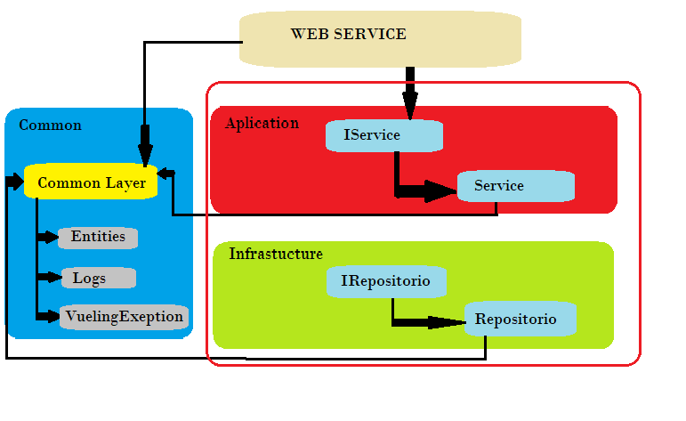

#Evaluación Vueling
La evaluación consiste en usuarios filtrados por id segun su rol que puede ser "user" o "admin"
 además de también persistir los datos en un fichero, tambien puede ser una base de datos.
Para seguir con las pautas del cometido de la evaluación se tendrá en cuenta la arquitectura DDD 
separando por capas las diferentes funcionalidades que debe realizar el web service y 
no conjuntarlo todo en un solo proyecto.

La evaluación será capaz de registrar todas las acciones que hará el usuario, tanto de información 
así como de las excepciones que se vayan produciendo.

La capa de servicios llamará a la web service cedida por Vueling desde una clase HttpClient.

Las pautas a seguir serán dadas por los principios SOLID así tener un código estable a la larga.

Implementar todos los tests: UnitTest, IntegrationTest y BehaviorTest para un seguimiento funcional correcto.

Utilizar JWT (Json Web Token) para la implementación de autorización y autenticación de usuario.

Para una actualización de los datos se utilizará Quartz que automatizará en un periodo de una hora 
la petición de datos si ha habido algun cambio.

#Log4net
Para la repeticion de código se ha puesto esta librería en la capa CommonLayer ya que se piensa registrar cada
acción del usuario, recibiendo por parámetro el mensaje para que lo guarde en un fichero segun su nivel de importancia,
se guardarán en ficheros distintos depenediendo si son de información o de errores que se registran
las excepciones capturadas.

#NewtonSoft
Para la serialización y desearialización se usa esta libreria tanto para la lectura del web service como para 
la persistencia.

Esta libreria está en la capa de infraestructura que trata con los datos directamente. Los ficheros json que generan se guardan en
la carpeta principal del proyecto, muestra los listados de los clientes y las polizas.

#Excepciones personalidas
Todas las excepciones serán emitidas desde VuelingException que está en el proyecto common así puede ser usado 
por todo el web service.

#StrongTypes
Separar en la capa de infraestructura funcionalidades correctas a su cometido, captura y devolución de datos, y no quitar el NewtonSoft 
de la capa de apliación.

Para evitar strings en todo el web service se ha añadido un fichero de recursos en cada proyecto, además de añadir al web.config 
 variables de configuración.
 
#Aspectos a mejorar
Generar la persistencia de los datos a la hora de ejecutar la aplicación para tener la información 
almacenada desde un principio, y ademas que esta petición la haga cada hora con ayuda de Quartz.

Por falta de tiempo se ha descuidado los tests que son importantes para el correcto funcionamiento
 del web service.
 
Devolver los errores resultantes de los Http Errors del las peticiones lanzadas desde HttpClient.

Tener desde el principio un esquema estable que permitiera un repartición de funcionalidades más sencillo, ya que al ir 
añadiendo funcionalidades se ha ido complicando. 
